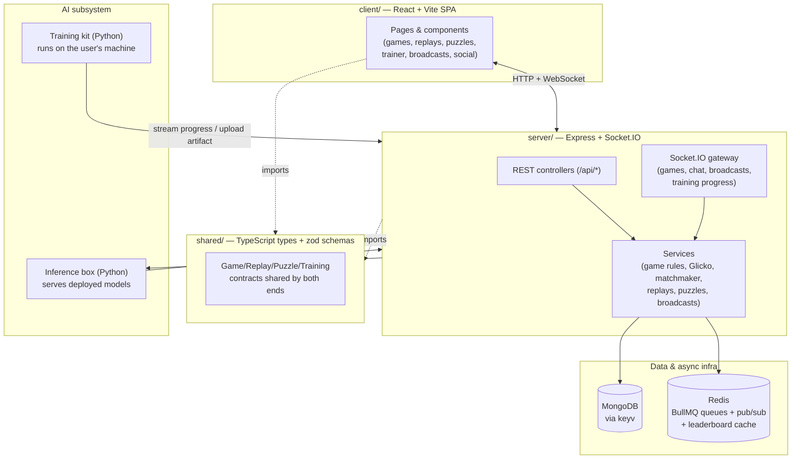
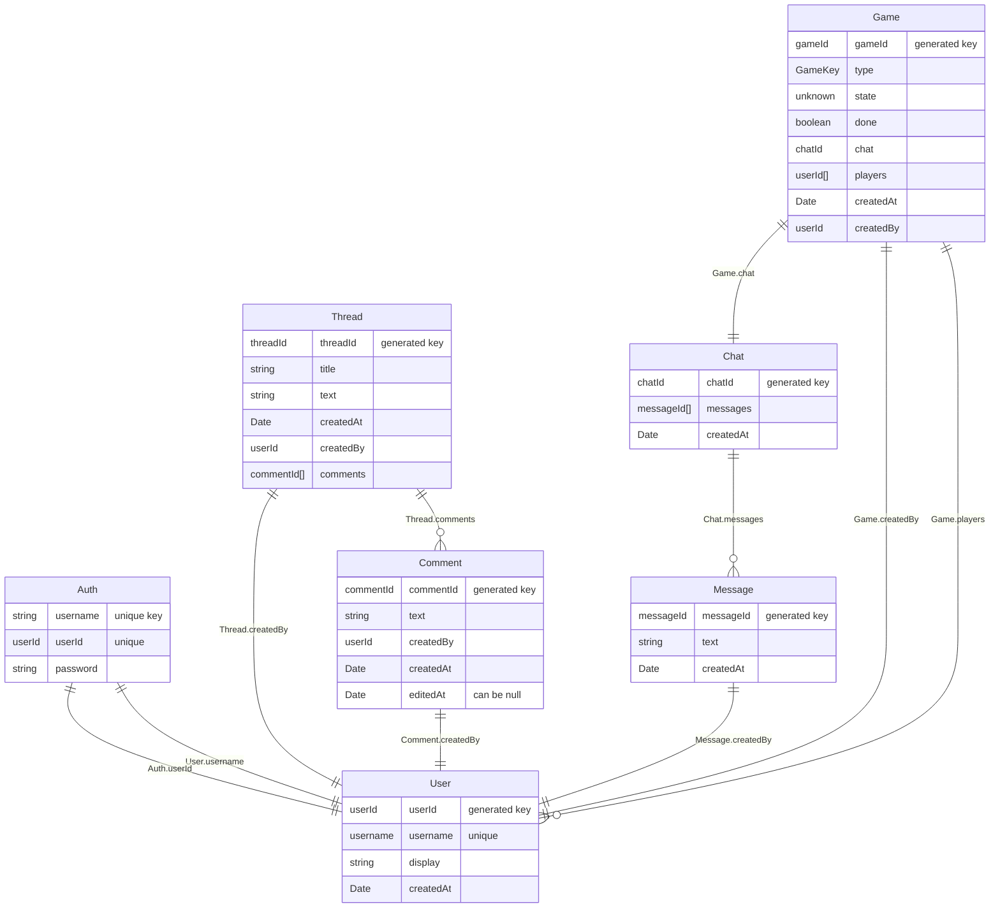

[](https://classroom.github.com/a/vWAG9U_Y)

# FourNite!

**FourNite!** is a full competitive games platform. Players are matched into
ranked or casual games of Nim, Tic‑Tac‑Toe, Connect 4, Checkers, and Number
Guesser; every finished match becomes a watchable, annotatable **replay**;
games in progress can be **broadcast live** with a delayed feed and moderated
chat; and a daily **puzzle** for each game keeps a separate puzzle Elo.

The twist that makes it an arena is that you don't have to play yourself. You
can **train your own AI**, deploy it, and queue it as your opponent or your
champion. A local **training kit** streams a run from your machine into the
platform; the trained model's artifact is stored server‑side and served to a
self‑hosted **inference box** that plays live moves on your behalf.

Everything is written in TypeScript (React on the front end, Express +
Socket.IO on the back end) with the model‑training kit in Python.

> **Live deployment:** <https://summer26-project-su26-group-109.onrender.com>

## Feature tour

- **Play** — ranked/casual matchmaking across five games, with a live in‑game
  chat and a reconnect path for unfinished games.
- **Ratings & leaderboards** — per‑game
  [Glicko‑2](https://en.wikipedia.org/wiki/Glicko_rating_system) ratings, tier
  badges, and daily/all‑time leaderboards (humans _and_ AIs).
- **Replays** — every completed match is archived; watch it back move‑by‑move,
  download it, add **annotations**, or request engine **analysis**.
- **Puzzles** — a daily puzzle per game with its own Elo, hints, a streak, and
  a practice/training feed.
- **AI training & inference** — train models from your own machine via the
  training kit, watch progress live, deploy them, and have them play real
  games and puzzles. Models can be **forked** and browsed on model cards.
- **Live broadcasts** — "Go Live" on an in‑progress game; spectators watch a
  delayed feed with rate‑limited, slow‑mode‑capable broadcast chat.
- **Social** — profiles with activity heatmaps, an Instagram‑style follower
  graph + following feed, bookmarked highlight clips, and a discussion forum.

## Getting started

**Prerequisites:** Node **24.x** is recommended (CI runs on 24). The server
executes TypeScript directly (`node ./src/server.ts`), so a recent Node with
native type stripping is required — older LTS versions will not start it. The
optional AI training kit additionally needs Python 3.10+.

Run `npm install` in the root directory to install dependencies for the
`client`, `server`, and `shared` workspaces.

### Working on the application (development mode)

Development mode watches files and reloads on change. To run FourNite!
locally:

1. Run `npm run dev` in the top‑level directory, **or**
2. Open two terminals — run `npm run dev` in `server/`, and `npm run dev` in
   `client/`.

The `client` terminal prints a URL (usually <http://localhost:4530/>). Log in
with any of the seeded accounts: `user0`/`pwd0000`, `user1`/`pwd1111`,
`user2`/`pwd2222`, `user3`/`pwd3333`.

### Environment / external services

Core gameplay runs with no extra setup (an in‑memory store is used by
default). The advanced subsystems read configuration from the server
environment:

| Variable                                                                | Used for                                                                                                                             |
| ----------------------------------------------------------------------- | ------------------------------------------------------------------------------------------------------------------------------------ |
| `MONGODB_URI`                                                           | Persistent document store (via `keyv`); omit for in‑memory dev.                                                                      |
| `REDIS_URL`                                                             | BullMQ job queues (puzzle generation, training) + training‑progress pub/sub + leaderboard caching. Supports self‑signed `rediss://`. |
| `INFERENCE_SERVICE_URL` / `INFERENCE_SHARED_TOKEN` / `INFERENCE_TLS_CA` | The self‑hosted Python inference box that runs deployed models.                                                                      |

### Checking the application

From the repository root:

- `npm run check` — typecheck all three workspaces with TypeScript
- `npm run lint` — lint all three workspaces with ESLint
- `npm run test` — runs each workspace's test suite: the **server** and
  **shared** Vitest suites, plus the **client** Playwright end‑to‑end tests
- `npm run test:unit:coverage -w client` — the client **unit** (Vitest +
  Testing Library) suite with a coverage report
- `npm run playwright` — open the Playwright e2e runner in UI mode

### Database migrations

FourNite! stores its data as JSON documents in MongoDB via the `keyv` library.
Because there is no enforced schema, every schema change ships as a small
idempotent TypeScript migration under `server/src/migrations/`. The migration
runner records applied migrations in `MigrationLogRepo` so every developer's
MongoDB instance converges on the current shape.

The first thing to do after pulling teammate changes (and before
`npm run dev`) is bring your local DB up to date:

- `npm run -w server migrate:status` — show applied vs pending migrations
- `npm run -w server migrate` — apply every pending migration (safe to re‑run)
- `npm run -w server migrate:create <name>` — scaffold a new migration

Full framework docs:
[`server/src/migrations/README.md`](./server/src/migrations/README.md).
Human‑readable schema reference: [`db/SCHEMA.md`](./db/SCHEMA.md).

### Building for production

`npm run build -w=client` produces the production client build. Then start the
server in production mode with `npm start -w=server` and visit
<http://localhost:8000/> (in production the Express server also serves the
built client).

## Architecture



### Tech stack

- **Frontend:** React, Vite, TypeScript, React Router, Socket.IO client.
- **Backend:** Node + Express, Socket.IO, `keyv` over MongoDB, Redis +
  [BullMQ](https://docs.bullmq.io/) for background jobs,
  [Zod](https://zod.dev/) for validation.
- **AI:** Python training kit (PyTorch / Stable‑Baselines3 PPO) + a FastAPI
  inference service.
- **Tooling:** Vitest (unit/integration), Playwright (e2e), ESLint, Prettier,
  TypeScript project references across the workspace.

## Codebase folder structure

- `client/` — the React frontend: pages (`src/pages`), reusable UI and feature
  components (`src/components`), game boards (`src/games`), hooks, and the
  service layer (`src/services`) that wraps the REST/socket APIs.
- `server/` — the Express backend: `controllers/` (HTTP + socket handlers),
  `services/` (business logic: game rules, ratings, matchmaking, replays,
  puzzles, training/inference), `games/` (per‑game rules engines), and
  `migrations/`.
- `shared/` — TypeScript types and Zod schemas used by both ends so the wire
  contracts stay in sync.
- `ai/` — the Python training kit (`train.py`, adapters), the inference
  service, and their tests. The kit is downloadable from a running server at
  `/api/training/kit/install.sh`.
- `db/` — the human‑readable schema reference.

## API routes

REST endpoints are mounted in [`server/src/app.ts`](./server/src/app.ts) under
`/api`. Auth rides in the request body (`{ auth, payload }`) rather than
headers.

| Group              | Endpoints                                                                                                                                                                      |
| ------------------ | ------------------------------------------------------------------------------------------------------------------------------------------------------------------------------ |
| `/api/game`        | `POST /create`, `GET /list`, `GET /:id`                                                                                                                                        |
| `/api/user`        | `POST /list`, `POST /login`, `POST /signup`, `POST /:username` (update), `GET /:username`                                                                                      |
| `/api/thread`      | `POST /create`, `GET /list`, `GET /:id`, `POST /:id/comment`                                                                                                                   |
| `/api/profile`     | `GET /:username` (full profile summary)                                                                                                                                        |
| `/api/follow`      | `POST /feed`, `GET /:username/followers`, `GET /:username/following`, `POST /:username`, `POST /:username/unfollow`                                                            |
| `/api/leaderboard` | `GET /:gameKey`                                                                                                                                                                |
| `/api/matchmaker`  | `GET /queue`                                                                                                                                                                   |
| `/api/rating`      | per‑game/player Glicko ratings (`rating.ratingRouter()`)                                                                                                                       |
| `/api/replay`      | `GET /list`, `GET /:matchId`, `GET /:matchId/download`, `POST /:matchId/view`, `POST /:matchId/analysis`                                                                       |
| `/api/annotation`  | `POST /create`, `GET /:id`                                                                                                                                                     |
| `/api/puzzle`      | `GET /leaderboard`, `GET /:gameKey`, `POST /:gameKey/attempt`, `POST /:gameKey/attempt/ai`, `POST /:gameKey/hint`, `GET /:gameKey/training`, `POST /:gameKey/training/attempt` |
| `/api/broadcast`   | `POST /create`, `GET /list`, `GET /:id`, `POST /:id/end`, `POST /:id/slowmode`                                                                                                 |
| `/api/highlight`   | `POST /create`, `POST /list`                                                                                                                                                   |
| `/api/model`       | `POST /upload`, `GET /user/:username`, `GET /:id`, `POST /:id/deploy`, `POST /:modelId/fork`, `PATCH /deployment/:id`                                                          |
| `/api/training`    | training runs/jobs + the downloadable kit (`training.trainingRouter()`)                                                                                                        |
| `/api/deployment`  | deployed‑model lifecycle (`deployment.deploymentRouter()`)                                                                                                                     |
| `/api/inference`   | machine‑to‑machine artifact pull for the inference box (shared‑token gated)                                                                                                    |

### WebSockets

Real‑time features run over Socket.IO; the event contract lives in
[`shared/src/socket.types.ts`](./shared/src/socket.types.ts). Handlers are
wired in `app.ts`:

- **Chat:** `chatJoin`, `chatLeave`, `chatSendMessage`
- **Games:** `gameJoinAsPlayer`, `gameMakeMove`, `gameStart`, `gameWatch`
- **Matchmaking:** `matchmakingJoin`, `matchmakingLeave`
- **Replays:** `replayWatch`, `replayLeave` (live watcher counts)
- **Broadcasts:** `broadcastWatch`, `broadcastLeave`, `broadcastChatSend`
- **Training progress:** `subscribe` / `unsubscribe` (bridged from Redis
  pub/sub)

## The AI training & inference pipeline

Training happens on the user's own machine and streams back to the platform;
the trained artifact is stored server‑side and loaded on demand by the
inference box.

```mermaid
sequenceDiagram
    participant U as User's machine (training kit)
    participant S as FourNite server
    participant R as Redis (BullMQ + pub/sub)
    participant B as Inference box (Python)

    U->>S: curl install.sh, then train.py --job-id
    U->>S: stream progress (session_reporter)
    S->>R: publish progress
    R-->>S: bridge → Socket.IO
    S-->>U: live progress on the Trainer dashboard
    U->>S: upload trained artifact (.pth)
    Note over S: model stored; user deploys it
    S->>B: load model (deployment)
    B->>S: pull artifact (/api/inference/artifact/:modelId)
    Note over S,B: during a live game, the AI's turn:
    S->>B: request move (state + legal moves)
    B-->>S: chosen move
```

## Data architecture

The full, current schema — users, games, replays, AI models, ratings, matches,
annotations, puzzles, broadcasts, follows, and highlights — lives at
[`db/SCHEMA.md`](./db/SCHEMA.md). The starter‑code core is shown below:



## Adding a new game

FourNite!'s games share a common shape: state stored on the server, a view
sent to players, and a move sent back. To add a new game `example`:

- In a new file `shared/src/games/example.types.ts`, define `ExampleState`
  (server), `ExampleView` (sent to players), and `ExampleMove` (sent by
  players).
- In `shared/src/game.types.ts`: import `ExampleView`, re‑export the new
  types, add `example` to `zGameKey`, and add
  `{ type: 'example'; view: ExampleView }` to `TaggedGameView`.
- In a new file `server/src/games/example.ts`, implement the rules and export
  `exampleLogic` and `exampleGameService`.
- In `server/src/services/game.service.ts`, register
  `example → exampleGameService` in `gameServices`.
- In a new file `client/src/games/ExampleGame.tsx`, define an `ExampleGame`
  component taking `GameProps<ExampleView, ExampleMove>`.
- In `client/src/games/GameDispatch.tsx`, add a case for `'example'`.
- In `client/src/util/consts.ts`, map `example` to its user‑facing name.

To make a game AI‑trainable and puzzle‑enabled, add an adapter under
`ai/adapter/` and wire it into the puzzle/training catalogs (see the existing
Nim/Tic‑Tac‑Toe/Connect 4/Checkers adapters as references).
