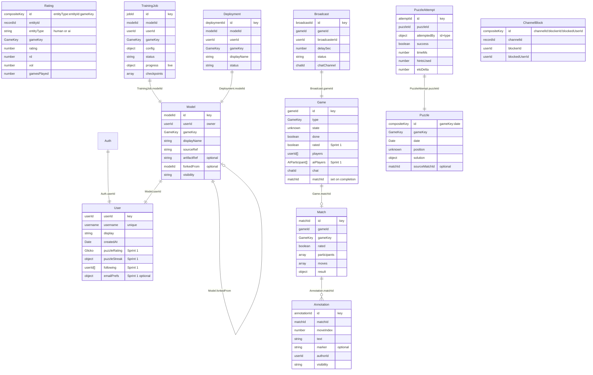

# GameNite Arena - Database Schema Reference

**Storage:** Keyv on top of MongoDB. Each "table" is a MongoDB collection of
JSON documents keyed by string id. There is no relational schema, no
foreign-key enforcement, no transactions across collections.

**Source of truth:** TypeScript interfaces in `server/src/models.ts`. This
document is the human-readable mirror.

**Migration tool:** `npm run -w server migrate`. See
`server/src/migrations/README.md` for the workflow when you need to add a new
field.

---

## Tables Inventory

| Repo                  | Repo name (Keyv) | Key                                                    | Sprint                      |
| --------------------- | ---------------- | ------------------------------------------------------ | --------------------------- |
| AuthRepo              | `auth`           | `username` (non-random)                                | starter                     |
| UserRepo              | `user`           | UUID                                                   | starter (extended Sprint 1) |
| ChatRepo              | `chat`           | UUID                                                   | starter                     |
| MessageRepo           | `message`        | UUID                                                   | starter                     |
| ThreadRepo            | `thread`         | UUID                                                   | starter                     |
| CommentRepo           | `comment`        | UUID                                                   | starter                     |
| GameRepo              | `game`           | UUID                                                   | starter (extended Sprint 1) |
| **ModelRepo**         | `model`          | UUID                                                   | Sprint 1 (new)              |
| **TrainingJobRepo**   | `trainingJob`    | UUID                                                   | Sprint 1 (new)              |
| **DeploymentRepo**    | `deployment`     | UUID                                                   | Sprint 1 (new)              |
| **RatingRepo**        | `rating`         | composite `${entityType}:${entityId}:${gameKey}`       | Sprint 1 (new)              |
| **MatchRepo**         | `match`          | UUID                                                   | Sprint 1 (new)              |
| **AnnotationRepo**    | `annotation`     | UUID                                                   | Sprint 1 (new)              |
| **PuzzleRepo**        | `puzzle`         | composite `${gameKey}:${YYYY-MM-DD}`                   | Sprint 1 (new)              |
| **PuzzleAttemptRepo** | `puzzleAttempt`  | UUID                                                   | Sprint 1 (new)              |
| **BroadcastRepo**     | `broadcast`      | UUID                                                   | Sprint 1 (new)              |
| **ChannelBlockRepo**  | `channelBlock`   | composite `${channelId}:${blockerId}:${blockedUserId}` | Sprint 1 (new)              |
| **TrainingTokenRepo** | `trainingToken`  | the token string itself (random 256-bit hex)           | Sprint 2 (local training)   |
| **MigrationLogRepo**  | `migrationLog`   | migration id (e.g. `000_sprint1_arena_baseline`)       | Sprint 1 (new, framework)   |

---

## Existing tables (starter code)

### AuthRecord (`auth`)

| Field      | Type     | Required | Notes                                                              |
| ---------- | -------- | -------- | ------------------------------------------------------------------ |
| `userId`   | RecordId | yes      | References `UserRecord`                                            |
| `password` | string   | yes      | Plain text in starter code; replace with hash in a later migration |

### UserRecord (`user`) - extended Sprint 1

| Field              | Type           | Required | Sprint   | Notes                                            |
| ------------------ | -------------- | -------- | -------- | ------------------------------------------------ |
| `username`         | string         | yes      | starter  | References `AuthRecord`                          |
| `display`          | string         | yes      | starter  | Display name                                     |
| `createdAt`        | DateISO        | yes      | starter  | When the user registered                         |
| **`puzzleRating`** | `GlickoRating` | yes      | Sprint 1 | Story 1.8 - separate from per-game match ratings |
| **`puzzleStreak`** | `PuzzleStreak` | yes      | Sprint 1 | Story 1.8 - current and best daily streaks       |
| **`following`**    | `RecordId[]`   | yes      | Sprint 1 | Story 3.9 - user ids this user follows           |
| **`emailPrefs`**   | `EmailPrefs`   | no       | Sprint 1 | Story 1.13 (Extension)                           |

`GlickoRating = { rating: number; rd: number; vol: number }` (defaults: 1500 /
350 / 0.06)
`PuzzleStreak = { current: number; best: number; lastSolvedAt?: DateISO }`
`EmailPrefs = { weeklyRecap?: boolean }`

### ChatRecord (`chat`)

| Field       | Type         | Required | Notes                      |
| ----------- | ------------ | -------- | -------------------------- |
| `messages`  | `RecordId[]` | yes      | References `MessageRecord` |
| `createdAt` | DateISO      | yes      |                            |

### MessageRecord (`message`)

| Field       | Type     | Required | Notes                   |
| ----------- | -------- | -------- | ----------------------- |
| `text`      | string   | yes      |                         |
| `createdBy` | RecordId | yes      | References `UserRecord` |
| `createdAt` | DateISO  | yes      |                         |

### ThreadRecord (`thread`)

| Field       | Type         | Required | Notes                      |
| ----------- | ------------ | -------- | -------------------------- |
| `title`     | string       | yes      |                            |
| `text`      | string       | yes      |                            |
| `createdAt` | DateISO      | yes      |                            |
| `createdBy` | RecordId     | yes      | References `UserRecord`    |
| `comments`  | `RecordId[]` | yes      | References `CommentRecord` |

### CommentRecord (`comment`)

| Field       | Type     | Required | Notes                   |
| ----------- | -------- | -------- | ----------------------- |
| `text`      | string   | yes      |                         |
| `createdBy` | RecordId | yes      | References `UserRecord` |
| `createdAt` | DateISO  | yes      |                         |
| `editedAt`  | DateISO  | no       |                         |

### GameRecord (`game`) - extended Sprint 1

| Field                    | Type                            | Required | Sprint   | Notes                                                              |
| ------------------------ | ------------------------------- | -------- | -------- | ------------------------------------------------------------------ |
| `type`                   | GameKey                         | yes      | starter  | "nim" or "guess" today; will extend to checkers/connect4/tictactoe |
| `state`                  | unknown                         | no       | starter  | Per-game state; absent until the game starts                       |
| `done`                   | boolean                         | yes      | starter  |                                                                    |
| `chat`                   | RecordId                        | yes      | starter  | References `ChatRecord`                                            |
| `players`                | `RecordId[]`                    | yes      | starter  | References `UserRecord` (human players only)                       |
| **`aiPlayers`**          | `AIParticipant[]`               | yes      | Sprint 1 | Story 2.6 - AI participants distinct from `players`                |
| **`rated`**              | boolean                         | yes      | Sprint 1 | Story 1.2 - whether this contributes to ratings                    |
| **`delaySec`**           | number                          | no       | Sprint 1 | Story 3.7 - broadcaster-set delay 0-60s                            |
| **`invalidMoveStreaks`** | `{ [modelId: string]: number }` | no       | Sprint 1 | Story 2.8 - AI forfeits at 3                                       |
| **`matchId`**            | RecordId                        | no       | Sprint 1 | Story 3.1 - set when the game completes                            |
| `createdAt`              | DateISO                         | yes      | starter  |                                                                    |
| `createdBy`              | RecordId                        | yes      | starter  | References `UserRecord`                                            |

`AIParticipant = { deploymentId: RecordId; modelId: RecordId; displayName: string }`

---

## New tables (Sprint 1)

### ModelRecord (`model`)

A user-uploaded AI model. The Python source lives in object storage at
`sourceRef`; the trained `.pth` lands at `artifactRef` after the first
successful training job.

| Field         | Type                    | Required | Story | Notes                                                |
| ------------- | ----------------------- | -------- | ----- | ---------------------------------------------------- |
| `userId`      | RecordId                | yes      | 2.4   | References `UserRecord` (owner)                      |
| `gameKey`     | GameKey                 | yes      | 2.2   | Which game this model targets                        |
| `displayName` | string                  | yes      |       | Shown on leaderboards / model cards                  |
| `sourceRef`   | string                  | yes      | 2.1   | Object-storage key for the uploaded .py              |
| `artifactRef` | string                  | no       | 2.4   | Object-storage key for the .pth (set after training) |
| `forkedFrom`  | RecordId                | no       | 2.13  | Parent model id if this is a fork                    |
| `visibility`  | `"private" \| "public"` | yes      | 2.13  | Default "private"                                    |
| `createdAt`   | DateISO                 | yes      |       |                                                      |
| `updatedAt`   | DateISO                 | yes      |       |                                                      |

### TrainingJobRecord (`trainingJob`)

A queued, running, or completed training run for a model.

| Field         | Type                                                             | Required | Story | Notes                                                            |
| ------------- | ---------------------------------------------------------------- | -------- | ----- | ---------------------------------------------------------------- |
| `modelId`     | RecordId                                                         | yes      | 2.2   | References `ModelRecord`                                         |
| `userId`      | RecordId                                                         | yes      |       | References `UserRecord` (for quick lookup)                       |
| `gameKey`     | GameKey                                                          | yes      |       |                                                                  |
| `config`      | `TrainingConfig`                                                 | yes      | 2.2   | `{ episodes, learningRate, extra?: object }`                     |
| `status`      | `"queued" \| "running" \| "completed" \| "failed" \| "canceled"` | yes      |       |                                                                  |
| `progress`    | `TrainingProgress`                                               | yes      | 2.3   | `{ episodes, meanReward, winRate, updatedAt }` updated by worker |
| `checkpoints` | `TrainingCheckpoint[]`                                           | yes      | 2.10  | `{ episode, artifactRef, createdAt }`                            |
| `error`       | string                                                           | no       |       | Set when status is "failed"                                      |
| `createdAt`   | DateISO                                                          | yes      |       |                                                                  |
| `completedAt` | DateISO                                                          | no       |       | Set when status is terminal                                      |

### DeploymentRecord (`deployment`)

A runtime slot holding a trained model that can play matches.

| Field         | Type                                | Required | Story | Notes                                                                                           |
| ------------- | ----------------------------------- | -------- | ----- | ----------------------------------------------------------------------------------------------- |
| `modelId`     | RecordId                            | yes      | 2.5   | References `ModelRecord`                                                                        |
| `userId`      | RecordId                            | yes      |       | References `UserRecord` (cap of 3 active per game per user enforced in service code, Story 2.7) |
| `gameKey`     | GameKey                             | yes      |       |                                                                                                 |
| `displayName` | string                              | yes      | 2.5   | Snapshot of ModelRecord.displayName at deploy time                                              |
| `status`      | `"active" \| "paused" \| "retired"` | yes      | 2.9   |                                                                                                 |
| `createdAt`   | DateISO                             | yes      |       |                                                                                                 |
| `updatedAt`   | DateISO                             | yes      |       |                                                                                                 |

### RatingRecord (`rating`)

Glicko 2 rating for one entity in one game. **Composite key:**
`${entityType}:${entityId}:${gameKey}` so any lookup is O(1) without scanning.
Use the `ratingKey()` helper in `models.ts`.

| Field           | Type              | Required | Story | Notes                          |
| --------------- | ----------------- | -------- | ----- | ------------------------------ |
| `entityId`      | RecordId          | yes      | 1.1   | userId or modelId              |
| `entityType`    | `"human" \| "ai"` | yes      | 1.1   |                                |
| `gameKey`       | GameKey           | yes      | 1.1   |                                |
| `rating`        | number            | yes      | 1.1   | default 1500                   |
| `rd`            | number            | yes      | 1.2   | rating deviation (default 350) |
| `vol`           | number            | yes      | 1.2   | volatility (default 0.06)      |
| `gamesPlayed`   | number            | yes      |       |                                |
| `lastUpdatedAt` | DateISO           | yes      |       |                                |

### MatchRecord (`match`)

A completed, replayable game. Created when a GameRecord finishes. The original
GameRecord's `matchId` is set to the new MatchRecord's id.

| Field          | Type                 | Required | Story | Notes                                    |
| -------------- | -------------------- | -------- | ----- | ---------------------------------------- |
| `gameId`       | RecordId             | yes      |       | References original `GameRecord`         |
| `gameKey`      | GameKey              | yes      |       | Copied for convenience                   |
| `rated`        | boolean              | yes      | 1.2   |                                          |
| `participants` | `MatchParticipant[]` | yes      | 3.1   | `{ id, type, displayName }`              |
| `moves`        | `MatchMove[]`        | yes      | 3.1   | `{ actor, move, timestamp }`             |
| `result`       | `MatchResult`        | yes      |       | `{ winnerId?, outcome, ratingChanges? }` |
| `createdAt`    | DateISO              | yes      |       |                                          |
| `completedAt`  | DateISO              | yes      |       |                                          |

### AnnotationRecord (`annotation`)

A user annotation on a specific move of a match.

| Field        | Type                    | Required | Story | Notes                                                             |
| ------------ | ----------------------- | -------- | ----- | ----------------------------------------------------------------- |
| `matchId`    | RecordId                | yes      | 3.4   | References `MatchRecord`                                          |
| `moveIndex`  | number                  | yes      | 3.4   | 0-indexed into `MatchRecord.moves`                                |
| `text`       | string                  | yes      | 3.4   | Free-text note                                                    |
| `marker`     | `AnnotationMarker`      | no       | 3.4   | `"good" \| "interesting" \| "questionable" \| "bad" \| "winning"` |
| `authorId`   | RecordId                | yes      |       | References `UserRecord`                                           |
| `visibility` | `"private" \| "shared"` | yes      | 3.11  |                                                                   |
| `shareToken` | string                  | no       | 3.11  | Present iff visibility is "shared"; used in study URLs            |
| `createdAt`  | DateISO                 | yes      |       |                                                                   |
| `editedAt`   | DateISO                 | no       |       |                                                                   |

### PuzzleRecord (`puzzle`)

A daily puzzle for one game. **Composite key:** `${gameKey}:${YYYY-MM-DD}` so
daily lookup is O(1). Use the `dailyPuzzleKey()` helper in `models.ts`.

| Field           | Type             | Required | Story | Notes                             |
| --------------- | ---------------- | -------- | ----- | --------------------------------- |
| `gameKey`       | GameKey          | yes      | 1.6   |                                   |
| `date`          | DateISO          | yes      | 1.6   | The day this is featured          |
| `position`      | unknown          | yes      | 1.6   | Per-game state to solve from      |
| `solution`      | `PuzzleSolution` | yes      | 1.7   | `{ moves[], explanation? }`       |
| `sourceMatchId` | RecordId         | no       | 1.6   | Match the position was mined from |
| `createdAt`     | DateISO          | yes      |       |                                   |

### PuzzleAttemptRecord (`puzzleAttempt`)

| Field         | Type                                      | Required | Story | Notes                                        |
| ------------- | ----------------------------------------- | -------- | ----- | -------------------------------------------- |
| `puzzleId`    | RecordId                                  | yes      | 1.7   | References `PuzzleRecord`                    |
| `attemptedBy` | `{ id: RecordId; type: "human" \| "ai" }` | yes      | 1.10  |                                              |
| `success`     | boolean                                   | yes      | 1.7   |                                              |
| `timeMs`      | number                                    | yes      | 1.7   | Used for fastest-solvers list                |
| `hintsUsed`   | number                                    | yes      | 1.12  | Each hint applies a small puzzle Elo penalty |
| `eloDelta`    | number                                    | yes      | 1.2   | Change applied to puzzle rating              |
| `createdAt`   | DateISO                                   | yes      |       |                                              |

### BroadcastRecord (`broadcast`)

A live broadcast of an in-progress game.

| Field           | Type                | Required | Story | Notes                   |
| --------------- | ------------------- | -------- | ----- | ----------------------- |
| `gameId`        | RecordId            | yes      | 3.7   | References `GameRecord` |
| `broadcasterId` | RecordId            | yes      | 3.7   | References `UserRecord` |
| `delaySec`      | number              | yes      | 3.7   | 0 to 60 seconds         |
| `status`        | `"live" \| "ended"` | yes      |       |                         |
| `chatChannel`   | RecordId            | yes      | 3.8   | References `ChatRecord` |
| `startedAt`     | DateISO             | yes      |       |                         |
| `endedAt`       | DateISO             | no       |       |                         |

### ChannelBlockRecord (`channelBlock`)

Per-channel block list entry. **Composite key:**
`${channelId}:${blockerId}:${blockedUserId}` for O(1) lookups and easy
channel-wide scans. Use the `channelBlockKey()` helper in `models.ts`.

| Field           | Type     | Required | Story | Notes                                        |
| --------------- | -------- | -------- | ----- | -------------------------------------------- |
| `channelId`     | RecordId | yes      | 3.8   | References `BroadcastRecord` or `ChatRecord` |
| `blockerId`     | RecordId | yes      | 3.8   | References `UserRecord`                      |
| `blockedUserId` | RecordId | yes      | 3.8   | References `UserRecord`                      |
| `createdAt`     | DateISO  | yes      |       |                                              |

### TrainingTokenRecord (`trainingToken`)

Expiring API token for the local-training channel (the trainer exchanges its
password once at `POST /api/training/token` and authenticates session calls
with the token). Keyed by the token string for O(1) lookup; expired records
are ignored at auth time.

| Field       | Type     | Required | Notes                    |
| ----------- | -------- | -------- | ------------------------ |
| `userId`    | RecordId | yes      | References `UserRecord`  |
| `username`  | string   | yes      | Snapshot for quick auth  |
| `createdAt` | DateISO  | yes      |                          |
| `expiresAt` | DateISO  | yes      | 24h TTL; checked at auth |

### MigrationLogRecord (`migrationLog`)

Append-only log of applied migrations. Maintained by
`server/src/migrations/MigrationRunner.ts`.

| Field         | Type    | Required | Notes                                               |
| ------------- | ------- | -------- | --------------------------------------------------- |
| `id`          | string  | yes      | The migration id, e.g. `000_sprint1_arena_baseline` |
| `description` | string  | yes      | Copied from the migration definition                |
| `appliedAt`   | DateISO | yes      |                                                     |
| `durationMs`  | number  | yes      |                                                     |

---

## ERD (Mermaid)



---

## Story coverage matrix

Quick reference for "which fields cover which COS":

| Story | COS                                          | Tables / fields                                                       |
| ----- | -------------------------------------------- | --------------------------------------------------------------------- |
| 1.1   | Per-game Glicko 2 rating per entity          | `RatingRepo`                                                          |
| 1.2   | Ratings update after every rated match       | `GameRecord.rated`, `RatingRepo`, `MatchRecord.result.ratingChanges`  |
| 1.3   | Mixed-entity top 100 leaderboard with badges | `RatingRepo` scan + `RatingRecord.entityType`                         |
| 1.4   | Matchmaker Elo window                        | Service layer; transient (no persistent record proposed for Sprint 1) |
| 1.5   | Per-game + overall average Elo               | `RatingRepo` (overall is computed across records)                     |
| 1.6   | Daily AI-generated puzzle                    | `PuzzleRepo` keyed by `gameKey:YYYY-MM-DD`                            |
| 1.7   | Pass/fail + preferred move                   | `PuzzleRecord.solution`, `PuzzleAttemptRecord.success`                |
| 1.8   | Puzzle Elo + streak                          | `UserRecord.puzzleRating`, `UserRecord.puzzleStreak`                  |
| 1.9   | Filter leaderboard by entity type            | Query parameter only                                                  |
| 1.10  | Submit deployed AI to puzzle                 | `PuzzleAttemptRecord.attemptedBy.type === "ai"`                       |
| 1.11  | Tier icons by Elo threshold                  | Config thresholds, no storage                                         |
| 1.12  | Hint reveal with Elo penalty                 | `PuzzleAttemptRecord.hintsUsed`                                       |
| 1.13  | Weekly email summary                         | `UserRecord.emailPrefs.weeklyRecap`                                   |
| 1.14  | Seasonal leaderboards                        | (deferred - no Sprint 1 storage)                                      |
| 1.15  | Friend versus puzzle race                    | (deferred - no Sprint 1 storage)                                      |
| 2.1   | Python heuristic upload                      | `ModelRecord.sourceRef`                                               |
| 2.2   | Training service runs episodes               | `TrainingJobRecord`                                                   |
| 2.3   | Live training progress                       | `TrainingJobRecord.progress`                                          |
| 2.4   | `.pth` artifact bound to account             | `ModelRecord.artifactRef`                                             |
| 2.5   | Deploy with display name                     | `DeploymentRecord`                                                    |
| 2.6   | Deployed model plays ranked matches          | `GameRecord.aiPlayers`                                                |
| 2.7   | Cap of 3 deployed models per game per user   | Enforced in service code (count `DeploymentRepo` where status=active) |
| 2.8   | Invalid move forfeit after 3                 | `GameRecord.invalidMoveStreaks`                                       |
| 2.9   | Pause / resume / retire                      | `DeploymentRecord.status`                                             |
| 2.10  | Resume training from checkpoint              | `TrainingJobRecord.checkpoints`                                       |
| 2.11  | Model card stats                             | Computed from `ModelRecord` + `MatchRecord` + `RatingRecord`          |
| 2.12  | Built-in adapter template                    | Static asset, no storage                                              |
| 2.13  | Fork public model                            | `ModelRecord.forkedFrom`, `ModelRecord.visibility`                    |
| 3.1   | Match persists with moves and timestamps     | `MatchRecord`                                                         |
| 3.2   | Replay viewer step controls                  | Derived from `MatchRecord.moves`                                      |
| 3.4   | Annotation panel                             | `AnnotationRecord`                                                    |
| 3.5   | Engine analysis                              | Computed; could cache in `MatchRecord` later                          |
| 3.6   | Download `.gnreplay`                         | Derived from `MatchRecord`                                            |
| 3.7   | Live broadcast with delay                    | `BroadcastRecord`, `GameRecord.delaySec`                              |
| 3.8   | Chat with per-channel block list             | `ChannelBlockRepo`                                                    |
| 3.9   | Follow + live-matches feed                   | `UserRecord.following`                                                |
| 3.11  | Annotations shareable via study link         | `AnnotationRecord.visibility`, `AnnotationRecord.shareToken`          |
| 3.12  | Highlight bookmark                           | (deferred - HighlightRepo can be added later)                         |
| 3.13  | OBS overlay                                  | API only, no storage                                                  |
| 3.14  | Replay rendered to MP4                       | Derived asset, no storage                                             |

---

## Running the migration

From the repository root:

```bash
# show what's applied and what's pending
npm run -w server migrate:status

# apply every pending migration
npm run -w server migrate

# create a new migration (scaffolds a new file)
npm run -w server migrate:create add_user_avatar_url
```

See `server/src/migrations/README.md` for the full authoring workflow.
